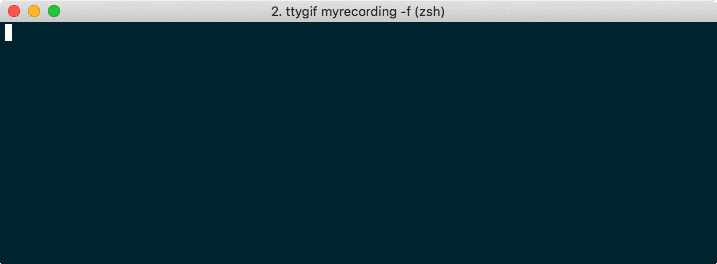

# tmux-powerline add-ons for Cassandra developers

This project contains a set of scripts that will add some additional segments to [tmux-powerline](https://github.com/erikw/tmux-powerline). You may find them useful if your a heavy users of [ccm](https://github.com/pcmanus/ccm) and [tmux](http://tmux.github.io/) like I am.

## Demo



## Installation

1. Install [tmux-powerline](https://github.com/erikw/tmux-powerline) and configure it using any of the provided segments
1. Clone repository `git clone https://github.com/spodkowinski/tmux-powerline-ccm.git`
1. Enable an external segements directory in your `.tmux-powerlinerc` pointing to the cloned repo, e.g.

    ```export TMUX_POWERLINE_DIR_USER_SEGMENTS="$HOME/.dotfiles/tmux-powerline-ccm"```

1. Add new segments to your theme. The segements are called `process` for showing the PIDs of running Cassandra processes and `ccm` for the selected ccm cluster. E.g.:

    ```
TMUX_POWERLINE_RIGHT_STATUS_SEGMENTS=(
  "process 9 255" \
  "ccm 3 255" \
  "weather 31 255" \
  "time 39 0 ${TMUX_POWERLINE_SEPARATOR_LEFT_BOLD}" \
)
    ```

1. Start tmux! :)


